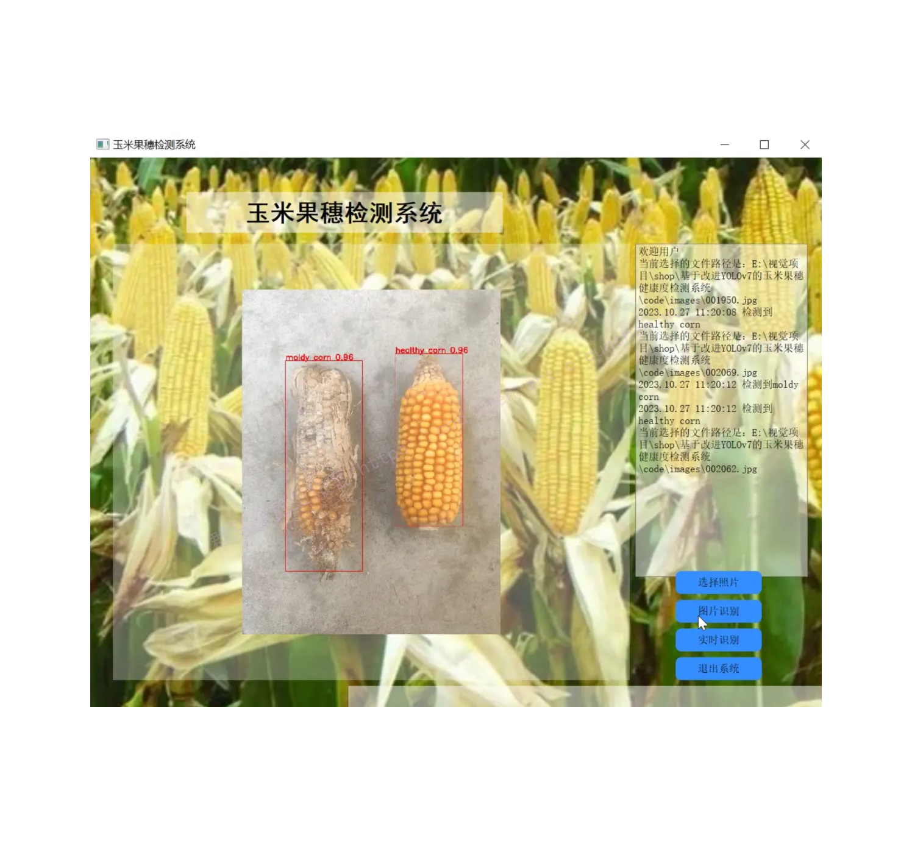
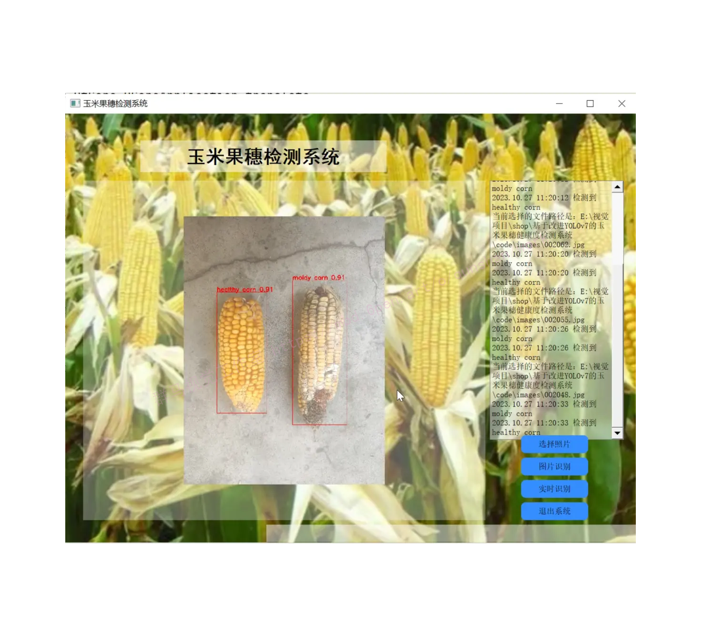
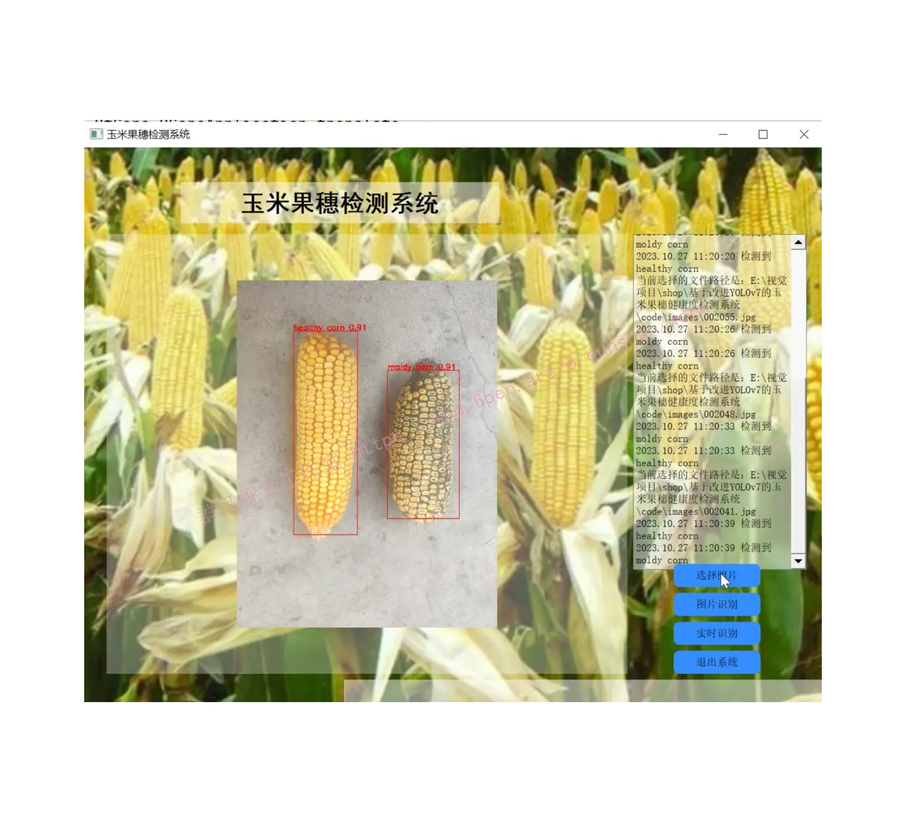
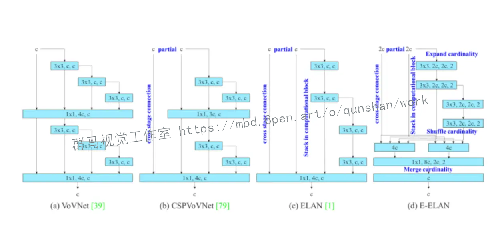
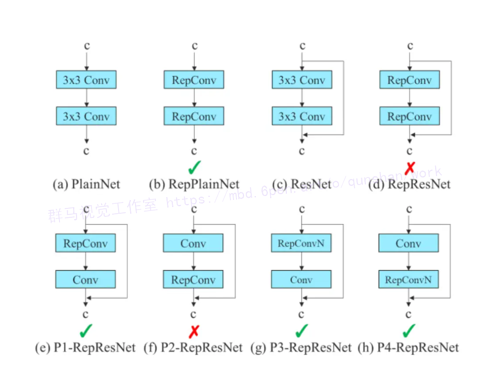
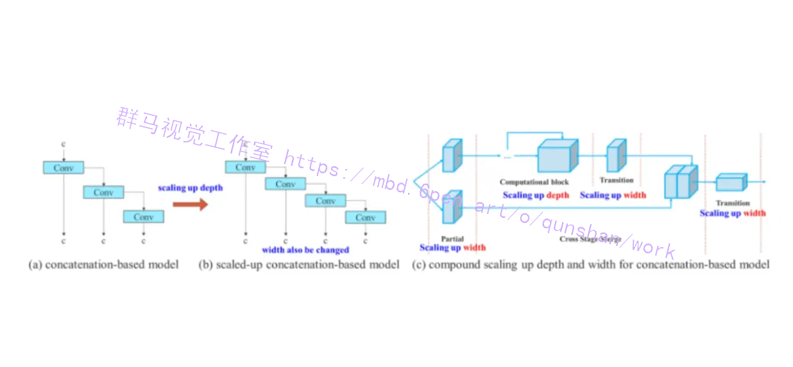
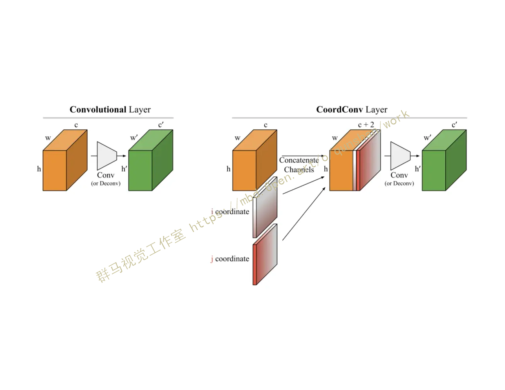
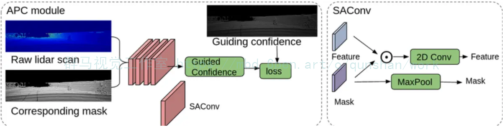
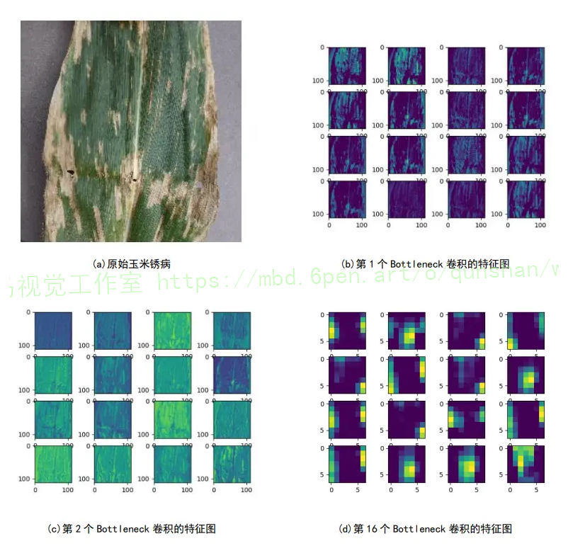
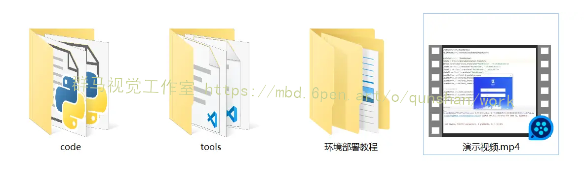


## 1.研究背景与意义


近年来，随着人工智能技术的快速发展，计算机视觉在农业领域的应用逐渐受到关注。其中，玉米果穗健康度检测是农业生产中的一个重要问题。玉米是世界上最重要的粮食作物之一，而果穗的健康度直接影响着玉米的产量和质量。因此，开发一种高效准确的玉米果穗健康度检测系统对于农业生产具有重要意义。

传统的玉米果穗健康度检测方法主要依赖于人工目测，这种方法存在着效率低、主观性强、易受人为因素影响等问题。而基于计算机视觉的玉米果穗健康度检测系统可以通过图像处理和机器学习算法自动分析图像中的果穗健康度信息，实现快速、准确的检测。因此，开发一种基于改进YOLOv7的玉米果穗健康度检测系统具有重要的现实意义和应用价值。

首先，基于改进YOLOv7的玉米果穗健康度检测系统可以提高检测的准确性。YOLOv7是一种基于深度学习的目标检测算法，其具有快速、准确的特点。通过对YOLOv7算法进行改进，可以进一步提高对玉米果穗的检测精度，减少误检和漏检的情况，从而提高果穗健康度检测的准确性。

其次，基于改进YOLOv7的玉米果穗健康度检测系统可以提高检测的效率。传统的玉米果穗健康度检测方法需要人工目测，耗时耗力。而基于计算机视觉的检测系统可以实现自动化检测，大大提高检测的效率。通过改进YOLOv7算法，可以进一步提高检测的速度，实现实时检测，为农民提供及时的果穗健康度信息，帮助他们做出科学决策。

此外，基于改进YOLOv7的玉米果穗健康度检测系统还可以为农业生产提供更多的数据支持。通过对大量果穗图像的分析，可以得到果穗的健康度信息，进而可以对果穗的生长情况、病虫害情况等进行分析和预测。这些数据可以为农民提供科学的种植管理建议，帮助他们提高玉米的产量和质量。

综上所述，基于改进YOLOv7的玉米果穗健康度检测系统具有重要的研究背景和意义。它可以提高检测的准确性和效率，为农业生产提供更多的数据支持，有助于提高玉米的产量和质量，促进农业的可持续发展。因此，开展相关研究对于推动农业智能化发展具有重要的意义。

## 2.图片演示






## 3.视频演示
[基于改进YOLOv7的玉米果穗健康度检测系统_哔哩哔哩_bilibili](https://www.bilibili.com/video/BV1my4y1w7rS/?spm_id_from=333.999.0.0&vd_source=ff015de2d29cbe2a9cdbfa7064407a08)

## 4.YOLOv7网络简介
### 高效的聚合网络设计
为提高网络的实时性，现有的研究主要从模型参数的个数、计算量、访存次数、输入/输出通道比、元素波动运算等多个角度出发，对网络的参数个数、计算复杂度和计算密度进行研究。事实上，这种研究方式与当年的ShuffleNetV2非常相似。YOLOv7里面用到了一个叫做 CSPVOVNet，这是 VoVNet的一个变种.CSPVoVNet不但解决了上述的建模问题，而且还对模型中的梯度流进行了分析，从而实现了对各层次权值的有效利用。无论是在学习中，还是在推演中，上面提到的几种方式，都是非常有效的。能够加快推理的速度，提高准确度。

在此基础上，本文提出了一种基于 ELAN的扩展型 ELAN方案。利用有效的远程注意网络对梯度上的最短最长路径进行控制，从而提高深度网络的学习效率。本文所提出的E-ELAN，通过扩展，分割，合并等方法，提高了网络的学习性能，而不会破坏原来的梯度路径。虽然在 ELAN中，不管梯度路长多少，以及多个运算模块的堆叠数目，都可以使网络保持在一个稳定的状态，但如果将这些计算模块不断地叠加在一起，就有可能打破系统的稳定性，降低系统的效率。


### 卷积重参化
重参数化是指在进行模型推理时，将多个模块进行组合，使之成为一个独立的模块。通常的重参数化技术是：
一种方法是使用多种训练样本对同一样本进行训练，并求其加权。
一种方法是在不同的迭代次数下，求出模型的权值的加权平均值。
尽管 RepConv能够很好地解决 VGG问题，但是如果把 RepConv直接用于 ResNet、 DenseNet等骨干网，其准确率就会大幅降低。由于 RepConv包含3x3卷积、1x3卷积、 identity连通等多种卷积结构，因此本文采用的是梯度传递路径法。
为此，申请人提出，当采用重参数卷积、残差连通、跨层连通时，可能不会出现 identity连通，并进一步研究再参数卷积与各种网络结构之间的关系。



## 5.核心代码讲解

#### 5.1 model.py

```python

class AddCoords(nn.Module):
    def __init__(self, with_r=False):
        super().__init__()
        self.with_r = with_r

    def forward(self, input_tensor):
        batch_size, _, x_dim, y_dim = input_tensor.size()

        xx_channel = torch.arange(x_dim).repeat(1, y_dim, 1)
        yy_channel = torch.arange(y_dim).repeat(1, x_dim, 1).transpose(1, 2)

        xx_channel = xx_channel.float() / (x_dim - 1)
        yy_channel = yy_channel.float() / (y_dim - 1)

        xx_channel = xx_channel * 2 - 1
        yy_channel = yy_channel * 2 - 1

        xx_channel = xx_channel.repeat(batch_size, 1, 1, 1).transpose(2, 3)
        yy_channel = yy_channel.repeat(batch_size, 1, 1, 1).transpose(2, 3)

        ret = torch.cat([
            input_tensor,
            xx_channel.type_as(input_tensor),
            yy_channel.type_as(input_tensor)], dim=1)

        if self.with_r:
            rr = torch.sqrt(torch.pow(xx_channel.type_as(input_tensor) - 0.5, 2) + torch.pow(yy_channel.type_as(input_tensor) - 0.5, 2))
            ret = torch.cat([ret, rr], dim=1)

        return ret

class CoordConv(nn.Module):
    def __init__(self, in_channels, out_channels, kernel_size=1, stride=1, with_r=False):
        super().__init__()
        self.addcoords = AddCoords(with_r=with_r)
        in_channels += 2
        if with_r:
            in_channels += 1
        self.conv = Conv(in_channels, out_channels, k=kernel_size, s=stride)

    def forward(self, x):
        x = self.addcoords(x)
        x = self.conv(x)
        return x


class ConvAWS2d(nn.Conv2d):
    def __init__(self,
                 in_channels,
                 out_channels,
                 kernel_size,
                 stride=1,
                 padding=0,
                 dilation=1,
                 groups=1,
                 bias=True):
        super().__init__(
            in_channels,
            out_channels,
            kernel_size,
            stride=stride,
            padding=padding,
            dilation=dilation,
            groups=groups,
            bias=bias)
        self.register_buffer('weight_gamma', torch.ones(self.out_channels, 1, 1, 1))
        self.register_buffer('weight_beta', torch.zeros(self.out_channels, 1, 1, 1))

    def _get_weight(self, weight):
        weight_mean = weight.mean(dim=1, keepdim=True).mean(dim=2,
                                                            keepdim=True).mean(dim=3, keepdim=True)
        weight = weight - weight_mean
        std = torch.sqrt(weight.view(weight.size(0), -1).var(dim=1) + 1e-5).view(-1, 1, 1, 1)
        weight = weight / std
        weight = self.weight_gamma * weight + self.weight_beta
        return weight

    def forward(self, x):
        weight = self._get_weight(self.weight)
        return super()._conv_forward(x, weight, None)

    def _load_from_state_dict(self, state_dict, prefix, local_metadata, strict,
                              missing_keys, unexpected_keys, error_msgs):
        self.weight_gamma.data.fill_(-1)
        super()._load_from_state_dict(state_dict, prefix, local_metadata, strict,
                                      missing_keys, unexpected_keys, error_msgs)
        if self.weight_gamma.data.mean() > 0:
            return
        weight = self.weight.data
        weight_mean = weight.data.mean(dim=1, keepdim=True).mean(dim=2,
                                                                 keepdim=True).mean(dim=3, keepdim=True)
        self.weight_beta.data.copy_(weight_mean)
        std = torch.sqrt(weight.view(weight.size(0), -1).var(dim=1) + 1e-5).view(-1, 1, 1, 1)
        self.weight_gamma.data.copy_(std)


class SAConv2d(ConvAWS2d):
    def __init__(self,
                 in_channels,
                 out_channels,
                 kernel_size,
                 s=1,
                 p=None,
                 g=1,
                 d=1,
                 act=True,
                 bias=True):
        super().__init__(
            in_channels,
            out_channels,
            kernel_size,
            stride=s,
            padding=autopad(kernel_size, p),
            dilation=d,
            groups=g,
            bias=bias)
        self.switch = torch.nn.Conv2d(
            self.in_channels,
            1,
            kernel_size=1,
            stride=s,
            bias=True)
        self.switch.weight.data.fill_(0)
        self.switch.bias.data.fill_(1)
        self.weight_diff = torch.nn.Parameter(torch.Tensor(self.weight.size()))
        self.weight_diff.data.zero_()
        self.pre_context = torch.nn.Conv2d(
            self.in_channels,
            self.in_channels,
            kernel_size=1,
            bias=True)
        self.pre_context.weight.data.fill_(0)
        self.pre_context.bias.data.fill_(0)
        self.post_context = torch.nn.Conv2d(
            self.out_channels,
            self.out_channels,
            kernel_size=1,
            bias=True)
        self.post_context.weight.data.fill_(0)
        self.post_context.bias.data.fill_(0)

        self.bn = nn.BatchNorm2d(out_channels)
        self.act = nn.SiLU() if act is True else (act if isinstance(act, nn.Module) else nn.Identity())

    def forward(self, x):
        avg_x = torch.nn.functional.adaptive_avg_pool2d(x, output_size=1)
        avg_x = self.pre_context(avg_x)
        avg_x = avg_x.expand_as(x)
        x = x + avg_x

        avg_x = torch.nn.functional.pad(x, pad=(2, 2, 2, 2), mode="reflect")
        avg_x = torch.nn.functional.avg_pool2d(avg_x, kernel_size=5, stride=1, padding=0)
        switch = self.switch(avg_x)

        weight = self._get_weight(self.weight)
        out_s = super()._conv_forward(x, weight, None)
        ori_p = self.padding
        ori_d = self.dilation
        self.padding = tuple(3 * p for p in self.padding)
        self.dilation = tuple(3 * d for d in self.dilation)
        weight = weight + self.weight_diff
        out_l = super()._conv_forward(x, weight, None)
        out = switch * out_s + (1 - switch) * out_l
        self.padding = ori_p
        self.dilation = ori_d

        avg_x = torch.nn.functional.adaptive_avg_pool2d(out, output_size=1)
        avg_x = self.post_context(avg_x)
        avg_x = avg_x.expand_as(out)
        out = out + avg_x
        return self.act(self.bn(out))
......
```

这是一个名为model.py的程序文件，主要包含了一些深度学习模型的定义和相关的辅助函数。

该文件导入了一些必要的库，如json、math、platform、warnings等，并从其他自定义的模块中导入了一些函数和类。

该文件定义了两个自定义的模块：AddCoords和CoordConv。AddCoords模块用于给输入的张量添加坐标信息，CoordConv模块是在普通的卷积层基础上添加了坐标信息的卷积层。

文件中还定义了一些其他的辅助函数和类，如ConvAWS2d、SAConv2d等，用于实现一些特殊的卷积操作。

整个文件的主要功能是定义了一些深度学习模型的结构和相关的辅助函数，用于在计算机视觉任务中进行图像处理和分析。

#### 5.2 torch_utils.py

```python

def torch_distributed_zero_first(local_rank: int):
    """
    Decorator to make all processes in distributed training wait for each local_master to do something.
    """
    if local_rank not in [-1, 0]:
        dist.barrier(device_ids=[local_rank])
    yield
    if local_rank == 0:
        dist.barrier(device_ids=[0])


def date_modified(path=__file__):
    # return human-readable file modification date, i.e. '2021-3-26'
    t = datetime.datetime.fromtimestamp(Path(path).stat().st_mtime)
   
```
这个程序文件是一个用于PyTorch的工具文件，包含了一些常用的函数和类。下面是文件中的一些重要部分：

1. `torch_distributed_zero_first`：一个上下文管理器，用于在分布式训练中使所有进程等待每个本地主进程执行某些操作。

2. `date_modified`：返回文件的人类可读的修改日期。

3. `git_describe`：返回人类可读的git描述。

4. `select_device`：选择设备（CPU或GPU）。

5. `time_sync`：返回PyTorch准确的时间。

6. `profile`：用于对模型的速度、内存和FLOPs进行分析。

7. `is_parallel`：判断模型是否是并行模型。

8. `de_parallel`：将模型转换为单GPU模型。


## 6.系统整体结构

根据以上分析，该程序是一个基于改进的YOLOv7模型的玉米果穗健康度检测系统。它包含了多个程序文件，每个文件都有不同的功能，共同构成了整个系统的功能和架构。

以下是每个文件的功能总结：

| 文件路径 | 功能概述 |
| -------- | -------- |
| check_img.py | 对指定文件夹中的图片进行降噪和压缩处理 |
| demo.py | 使用YOLOv7模型进行目标检测 |
| Interface.py | 加载模型并进行目标检测的接口文件 |
| model.py | 定义深度学习模型的结构和辅助函数 |
| torch_utils.py | 包含一些PyTorch的工具函数和类 |
| train.py | 用于训练模型的脚本 |
| ui.py | 用户界面文件 |
| models\common.py | 包含一些通用的模型组件 |
| models\experimental.py | 包含一些实验性的模型组件 |
| models\tf.py | 包含一些与TensorFlow相关的模型组件 |
| models\yolo.py | 包含YOLO模型的定义和相关函数 |
| models\__init__.py | 模型模块的初始化文件 |
| tools\activations.py | 包含一些激活函数 |
| tools\augmentations.py | 包含一些数据增强函数 |
| tools\autoanchor.py | 包含自动锚框生成的函数 |
| tools\autobatch.py | 包含自动批处理的函数 |
| tools\callbacks.py | 包含一些回调函数 |
| tools\datasets.py | 包含数据集加载和处理的函数 |
| tools\downloads.py | 包含一些下载相关的函数 |
| tools\general.py | 包含一些通用的辅助函数 |
| tools\loss.py | 包含一些损失函数 |
| tools\metrics.py | 包含一些评估指标函数 |
| tools\plots.py | 包含一些绘图函数 |
| tools\torch_utils.py | 包含一些PyTorch的辅助函数 |
| tools\__init__.py | 工具模块的初始化文件 |
| tools\aws\resume.py | 包含AWS平台的恢复训练函数 |
| tools\aws\__init__.py | AWS模块的初始化文件 |
| tools\flask_rest_api\example_request.py | 包含Flask REST API的示例请求函数 |
| tools\flask_rest_api\restapi.py | 包含Flask REST API的实现 |
| tools\loggers\__init__.py | 日志记录器模块的初始化文件 |
| tools\loggers\wandb\log_dataset.py | 包含WandB日志记录器的数据集日志函数 |
| tools\loggers\wandb\sweep.py | 包含WandB日志记录器的超参数搜索函数 |
| tools\loggers\wandb\wandb_utils.py | 包含WandB日志记录器的辅助函数 |
| tools\loggers\wandb\__init__.py | WandB日志记录器模块的初始化文件 |
| utils\activations.py | 包含一些激活函数 |
| utils\augmentations.py | 包含一些数据增强函数 |
| utils\autoanchor.py | 包含自动锚框生成的函数 |
| utils\autobatch.py | 包含自动批处理的函数 |
| utils\callbacks.py | 包含一些回调函数 |
| utils\datasets.py | 包含数据集加载和处理的函数 |
| utils\downloads.py | 包含一些下载相关的函数 |
| utils\general.py | 包含一些通用的辅助函数 |
| utils\loss.py | 包含一些损失函数 |
| utils\metrics.py | 包含一些评估指标函数 |
| utils\plots.py | 包含一些绘图函数 |
| utils\torch_utils.py | 包含一些PyTorch的辅助函数 |
| utils\__init__.py | 工具模块的初始化文件 |
| utils\aws\resume.py | 包含AWS平台的恢复训练函数 |
| utils\aws\__init__.py | AWS模块的初始化文件 |
| utils\flask_rest_api\example_request.py | 包含Flask REST API的示例请求函数 |
| utils\flask_rest_api\restapi.py | 包含Flask REST API的实现 |
| utils\loggers\__init__.py | 日志记录器模块的初始化文件 |
| utils\loggers\wandb\log_dataset.py | 包含WandB日志记录器的数据集日志函数 |
| utils\loggers\wandb\sweep.py | 包含WandB日志记录器的超参数搜索函数 |
| utils\loggers\wandb\wandb_utils.py | 包含WandB日志记录器的辅助函数 |
| utils\loggers\wandb\__init__.py | WandB日志记录器模块的初始化文件 |

这些文件共同构成了基于改进YOLOv7的玉米果穗健康度检测系统的功能和架构。

## 7.YOLOv7算法改进
YOLO（You Only Look Once）是一种广泛应用于计算机视觉领域的目标检测算法，其快速的实时性能和高准确性使其备受欢迎。YOLOv7是YOLO系列的最新版本，不仅延续了其出色的性能，还引入了一些重要的改进，其中包括CoordConv（Coordinate Convolution）和SAConv（Spatial Attention Convolution）。本文将详细讨论这两项改进，它们如何增强了YOLOv7的性能和功能。

### CoordConv（Coordinate Convolution）
CoordConv是由Uber AI Labs的研究人员提出的一种卷积操作，旨在处理图像中的坐标信息。在传统的卷积操作中，卷积核在图像上滑动并执行卷积操作，但是它们对于图像中的位置信息是不敏感的。CoordConv的目标是使卷积操作变得位置敏感，它在输入特征图中加入了位置信息作为额外的通道。这个位置信息可以是像素的坐标，也可以是归一化的坐标值，具体取决于应用的场景。


通过将坐标信息与输入特征图拼接在一起，CoordConv能够帮助神经网络更好地学习到输入数据中的空间关系，从而提高模型的性能。它在需要考虑输入数据的空间位置信息时，特别有用。

CoordConv的核心思想是在卷积操作之前，将输入数据与坐标信息相结合，从而增强了模型对位置信息的感知能力。这使得YOLOv7在处理具有复杂空间结构的图像时表现出色。

### SAConv（Spatial Attention Convolution）
SAConv是一种由Uber AI Labs的研究人员提出的空间注意力机制的卷积操作。传统的卷积操作在所有位置都应用相同的卷积核，而SAConv具有可学习的空间注意力权重，这意味着它能够动态地调整不同位置的卷积核权重。

SAConv的关键思想是，在进行卷积操作之前，先计算每个位置的空间注意力权重。这些权重由神经网络学习得出，然后被用来加权输入特征图的不同位置，从而生成具有位置敏感性的特征表示。这种机制使得神经网络在处理输入数据时能够更加关注重要的区域，从而提高了模型的感知能力和性能。


SAConv的引入使得YOLOv7在处理具有不同尺度和复杂性的目标时更加灵活，从而提高了检测准确性。


综合考虑CoordConv和SAConv的改进，它们共同提高了YOLOv7的性能。CoordConv增强了模型对位置信息的感知能力，使其能够更好地适应不同的场景和任务。SAConv引入了空间注意力机制，使模型能够更好地关注重要的图像区域，从而提高了检测准确性。

此外，这些改进方法并不仅限于YOLOv7，它们可以应用于其他计算机视觉任务和模型中，为图像处理领域的进一步研究和发展提供了有力的工具和思路。

总的来说，YOLOv7的改进包括CoordConv和SAConv，它们分别增强了模型对位置信息的感知和关注重要区域的能力。这些改进使YOLOv7成为一个更强大的目标检测模型，为计算机视觉领域的研究和应用带来了新的可能性。在未来，我们可以期待看到更多基于这些改进的研究和应用，推动计算机视觉技术的不断发展。

## 8.特征图可视化对比
通过对YOLOv7网络模型的卷积进行特性可视化，可以很容易地了解这个模型的认知状况。
这是一场灾难。从浅层到深部，选取一个卷积网络来实现可视化，得到的结果见图4-5。
YOLOv7模式中，顶部卷积为浅层卷积，底部卷积为深卷积，两者之间的关系是：
注释的要点不一样。分别选择网络的首个波特利尼克卷积，第二个波特利尼克卷积与第16个卷积Bottleneck用于对照。如图所示，在第16次 Bottleneck时，卷积图像的形状特性已经被确定
由于神经网络的浅层卷积结构中所抽取的特征更侧重于纹理，细节等，所以无法识别其信息。
在特征信息方面，基本上可以从一次波特拉尼克卷积到二次波特拉尼克卷积的图象中得到较为清楚的描述。而当卷积网络的层数增多时，深度卷积网络可以抽取出更多的抽象特征。
想要准确的表达出它的意义，还需要进行一系列的计算。普通卷积层随层数增加而抽取的特性
越是抽象，越是独特[6]。利用YOLOv7网络模型卷积提取图象信息
可视化显示，可以看到，当浅层卷积在识别目标时，所抽取的图像更明显的纹理，轮廓等特点[5]。


## 9.系统整合

下图[完整源码＆环境部署视频教程＆自定义UI界面](https://s.xiaocichang.com/s/25270b)



参考博客[《基于改进YOLOv7的玉米果穗健康度检测系统》](https://mbd.pub/o/qunshan/work)


## 10.参考文献
---
[1][黄太远](https://s.wanfangdata.com.cn/paper?q=%E4%BD%9C%E8%80%85:%22%E9%BB%84%E5%A4%AA%E8%BF%9C%22),[李旺](https://s.wanfangdata.com.cn/paper?q=%E4%BD%9C%E8%80%85:%22%E6%9D%8E%E6%97%BA%22),[邱亚西](https://s.wanfangdata.com.cn/paper?q=%E4%BD%9C%E8%80%85:%22%E9%82%B1%E4%BA%9A%E8%A5%BF%22),等.[基于形状特征和SVM多分类的铜仁地区茶叶病害识别研究](https://d.wanfangdata.com.cn/periodical/zzkj202006006)[J].[种子科技](https://sns.wanfangdata.com.cn/perio/zzkj).2020,(6).

[2][张永超](https://s.wanfangdata.com.cn/paper?q=%E4%BD%9C%E8%80%85:%22%E5%BC%A0%E6%B0%B8%E8%B6%85%22),[赵录怀](https://s.wanfangdata.com.cn/paper?q=%E4%BD%9C%E8%80%85:%22%E8%B5%B5%E5%BD%95%E6%80%80%22),[卜光苹](https://s.wanfangdata.com.cn/paper?q=%E4%BD%9C%E8%80%85:%22%E5%8D%9C%E5%85%89%E8%8B%B9%22).[基于卷积神经网络的花生种子筛选识别算法](https://d.wanfangdata.com.cn/periodical/jxnyxb202001013)[J].[江西农业学报](https://sns.wanfangdata.com.cn/perio/jxnyxb).2020,(1).DOI:10.19386/j.cnki.jxnyxb.2020.01.13 .

[3][周广斌](https://s.wanfangdata.com.cn/paper?q=%E4%BD%9C%E8%80%85:%22%E5%91%A8%E5%B9%BF%E6%96%8C%22),[刘珊珊](https://s.wanfangdata.com.cn/paper?q=%E4%BD%9C%E8%80%85:%22%E5%88%98%E7%8F%8A%E7%8F%8A%22),[王怡](https://s.wanfangdata.com.cn/paper?q=%E4%BD%9C%E8%80%85:%22%E7%8E%8B%E6%80%A1%22),等.[江苏省2019年新收获小麦质量情况调查](https://d.wanfangdata.com.cn/periodical/xdmfgy202001006)[J].[现代面粉工业](https://sns.wanfangdata.com.cn/perio/xdmfgy).2020,(1).17-21.DOI:10.3969/j.issn.1674-5280.2020.01.006 .

[4][赵立新](https://s.wanfangdata.com.cn/paper?q=%E4%BD%9C%E8%80%85:%22%E8%B5%B5%E7%AB%8B%E6%96%B0%22),[侯发东](https://s.wanfangdata.com.cn/paper?q=%E4%BD%9C%E8%80%85:%22%E4%BE%AF%E5%8F%91%E4%B8%9C%22),[吕正超](https://s.wanfangdata.com.cn/paper?q=%E4%BD%9C%E8%80%85:%22%E5%90%95%E6%AD%A3%E8%B6%85%22),等.[基于迁移学习的棉花叶部病虫害图像识别](https://d.wanfangdata.com.cn/periodical/nygcxb202007021)[J].[农业工程学报](https://sns.wanfangdata.com.cn/perio/nygcxb).2020,(7).DOI:10.11975/j.issn.1002-6819.2020.07.021 .

[5][戴泽翰](https://s.wanfangdata.com.cn/paper?q=%E4%BD%9C%E8%80%85:%22%E6%88%B4%E6%B3%BD%E7%BF%B0%22),[郑正](https://s.wanfangdata.com.cn/paper?q=%E4%BD%9C%E8%80%85:%22%E9%83%91%E6%AD%A3%22),[黄莉舒](https://s.wanfangdata.com.cn/paper?q=%E4%BD%9C%E8%80%85:%22%E9%BB%84%E8%8E%89%E8%88%92%22),等.[基于深度卷积神经网络的柑橘黄龙病症状识别](https://d.wanfangdata.com.cn/periodical/hnnydxxb202004016)[J].[华南农业大学学报](https://sns.wanfangdata.com.cn/perio/hnnydxxb).2020,(4).DOI:10.7671/j.issn.1001-411X.201909031 .

[6][张红涛](https://s.wanfangdata.com.cn/paper?q=%E4%BD%9C%E8%80%85:%22%E5%BC%A0%E7%BA%A2%E6%B6%9B%22),[李艺嘉](https://s.wanfangdata.com.cn/paper?q=%E4%BD%9C%E8%80%85:%22%E6%9D%8E%E8%89%BA%E5%98%89%22),[谭联](https://s.wanfangdata.com.cn/paper?q=%E4%BD%9C%E8%80%85:%22%E8%B0%AD%E8%81%94%22),等.[基于CS-SVM的谷子叶片病害图像识别](https://d.wanfangdata.com.cn/periodical/zjnyxb202002011)[J].[浙江农业学报](https://sns.wanfangdata.com.cn/perio/zjnyxb).2020,(2).DOI:10.3969/j.issn.1004-1524.2020.02.11 .

[7][许景辉](https://s.wanfangdata.com.cn/paper?q=%E4%BD%9C%E8%80%85:%22%E8%AE%B8%E6%99%AF%E8%BE%89%22),[邵明烨](https://s.wanfangdata.com.cn/paper?q=%E4%BD%9C%E8%80%85:%22%E9%82%B5%E6%98%8E%E7%83%A8%22),[王一琛](https://s.wanfangdata.com.cn/paper?q=%E4%BD%9C%E8%80%85:%22%E7%8E%8B%E4%B8%80%E7%90%9B%22),等.[基于迁移学习的卷积神经网络玉米病害图像识别](https://d.wanfangdata.com.cn/periodical/nyjxxb202002025)[J].[农业机械学报](https://sns.wanfangdata.com.cn/perio/nyjxxb).2020,(2).DOI:10.6041/j.issn.1000-1298.2020.02.025 .

[8][毛彦栋](https://s.wanfangdata.com.cn/paper?q=%E4%BD%9C%E8%80%85:%22%E6%AF%9B%E5%BD%A6%E6%A0%8B%22),[宫鹤](https://s.wanfangdata.com.cn/paper?q=%E4%BD%9C%E8%80%85:%22%E5%AE%AB%E9%B9%A4%22).[基于SVM和DS证据理论融合多特征的玉米病害识别研究](https://d.wanfangdata.com.cn/periodical/zgnjh202004024)[J].[中国农机化学报](https://sns.wanfangdata.com.cn/perio/zgnjh).2020,(4).DOI:10.13733/j.jcam.issn.2095-5553.2020.04.024 .

[9][陈书贞](https://s.wanfangdata.com.cn/paper?q=%E4%BD%9C%E8%80%85:%22%E9%99%88%E4%B9%A6%E8%B4%9E%22),[张祎俊](https://s.wanfangdata.com.cn/paper?q=%E4%BD%9C%E8%80%85:%22%E5%BC%A0%E7%A5%8E%E4%BF%8A%22),[练秋生](https://s.wanfangdata.com.cn/paper?q=%E4%BD%9C%E8%80%85:%22%E7%BB%83%E7%A7%8B%E7%94%9F%22).[基于多尺度稠密残差网络的JPEG压缩伪迹去除方法](https://d.wanfangdata.com.cn/periodical/dzkxxk201910027)[J].[电子与信息学报](https://sns.wanfangdata.com.cn/perio/dzkxxk).2019,(10).DOI:10.11999/JEIT180963 .

[10][李昊璇](https://s.wanfangdata.com.cn/paper?q=%E4%BD%9C%E8%80%85:%22%E6%9D%8E%E6%98%8A%E7%92%87%22),[王芬](https://s.wanfangdata.com.cn/paper?q=%E4%BD%9C%E8%80%85:%22%E7%8E%8B%E8%8A%AC%22).[基于深度残差网络的人脸关键点检测](https://d.wanfangdata.com.cn/periodical/hbgxycsjsxb201906013)[J].[测试技术学报](https://sns.wanfangdata.com.cn/perio/hbgxycsjsxb).2019,(6).DOI:10.3969/j.issn.1671-7449.2019.06.012 .


---
#### 如果您需要更详细的【源码和环境部署教程】，除了通过【系统整合】小节的链接获取之外，还可以通过邮箱以下途径获取:
#### 1.请先在GitHub上为该项目点赞（Star），编辑一封邮件，附上点赞的截图、项目的中文描述概述（About）以及您的用途需求，发送到我们的邮箱
#### sharecode@yeah.net
#### 2.我们收到邮件后会定期根据邮件的接收顺序将【完整源码和环境部署教程】发送到您的邮箱。
#### 【免责声明】本文来源于用户投稿，如果侵犯任何第三方的合法权益，可通过邮箱联系删除。